# 🌿 End-to-End Green Manufacturing Analytics with Databricks, Airflow, and Spark

This project showcases a complete data pipeline to analyze **green vs. non-green manufacturing efficiency** using a powerful modern data stack. It demonstrates how to seamlessly orchestrate **Databricks** notebooks and data pipelines using **Apache Airflow**, with notebook-based extraction, transformation, and analysis workflows managed through Airflow DAGs.

It leverages a range of tools:

* **Databricks** for notebook execution and data engineering
* **Apache Airflow** for orchestration
* **Spark SQL** and **DBT utils** for querying and transformation
* **Delta Lake** as the storage layer
* **Amazon S3** for raw data storage
* **Docker + Astro CLI** for local development and orchestration

You'll be guided step-by-step through setting up, loading data, and running analytics tasks using clear examples and intuitive diagrams.

---

## 📂 Repository Structure

Here's what's included:

* **`load_to_delta_lake`**

  * A DAG (Directed Acyclic Graph) using `DatabricksSqlOperator` and `DatabricksCopyIntoOperator` to load data from Amazon S3 to a Databricks Delta Lake.

* **`run_notebooks_simple_example`**

  * A straightforward DAG running Databricks notebooks using `DatabricksWorkflowTaskGroup` and `DatabricksNotebookOperators`.

* **`run_notebooks_complex`**

  * A more sophisticated DAG that executes notebooks with complex dependencies and parameter injections.

* **`setup_sample_data`**

  * A utility DAG that copies example data into Amazon S3 for initial setup.

* **`databricks_notebooks`**

  * Contains analytics and transformation notebooks:

    * 📓 **analytics.ipynb** - Analytics Green vs Not Green Manufacturing Efficiency
    * 📓 **extract\_green\_manufacturing.ipynb** - Select Green Initiative Manufacturing Facilities
    * 📓 **extract\_notgreen\_manufacturing.ipynb** - Select Not-Green Initiative Manufacturing Facilities
    * 📓 **transform\_green\_manufacturing.ipynb**:

      * Average green manufacturing across facilities daily
      * Compute net power use
      * Compute efficiency
    * 📓 **transform\_notgreen\_manufacturing.ipynb**:

      * Average non-green manufacturing across facilities daily
      * Compute net power use
      * Compute efficiency

---

## 🛠️ How to Set Up Locally

Follow these steps to set up the project on your local machine:

### Prerequisites:

* [Docker Desktop](https://www.docker.com/products/docker-desktop)
* [Astro CLI](https://docs.astronomer.io/astro/cli/install-cli)
* Databricks and AWS accounts

### 📋 Step-by-Step Guide:

1. **Clone the Repository**

```bash
git clone https://github.com/mahdimirmojarabian/end-to-end-airflow-databricks-green-manufacturing-pipeline.git
cd end-to-end-airflow-databricks-green-manufacturing-pipeline
```

2. **Environment Configuration**

* Copy `.env.example` and rename it to `.env`:

```bash
cp .env.example .env
```

* Edit `.env` and fill your Databricks and AWS credentials.

3. **Start Airflow Locally**

Launch Airflow using Astro CLI:

```bash
astro dev start
```

* Airflow UI: `http://localhost:8080`
  Default credentials: `admin` / `admin`

4. **Setup Databricks Environment**

* Copy notebooks from `/databricks_notebooks` into your Databricks workspace.

5. **Prepare Sample Data**

* Run DAG: `setup_sample_data` to copy sample datasets into Amazon S3.

6. **Load Data into Delta Lake**

* Execute DAG: `load_to_delta_lake` to transfer data from S3 into Databricks Delta Lake.

7. **Run Analytics Notebooks**

* Execute either:

  * **Simple Workflow:** `run_notebooks_simple_example`
  * **Complex Workflow:** `run_notebooks_complex`

---

## 📊 Analytics Notebook Workflow

The analytics notebooks perform the following transformations:

### ✅ **Green Manufacturing Facilities**

* **Extract**: Select facilities with green initiatives.
* **Transform**:

  * Calculate daily average across green facilities.
  * Compute net power consumption.
  * Determine efficiency.

### ✅ **Not-Green Manufacturing Facilities**

* **Extract**: Select facilities without green initiatives.
* **Transform**:

  * Calculate daily average across non-green facilities.
  * Compute net power consumption.
  * Determine efficiency.

---

## 🎨 Project Architecture

```mermaid
graph TD;
    SetupData["📁 setup_sample_data"] --> LoadDelta["🗃️ load_to_delta_lake"];
    LoadDelta --> SimpleDAG["📓 run_notebooks_simple_example"];
    LoadDelta --> ComplexDAG["📓 run_notebooks_complex"];

    subgraph Databricks
        SimpleDAG --> GreenAnalytics["🟢 Green Manufacturing Analytics"];
        SimpleDAG --> NotGreenAnalytics["🔴 Not-Green Manufacturing Analytics"];
        ComplexDAG --> GreenAnalytics;
        ComplexDAG --> NotGreenAnalytics;
    end
```



---

## 💡 Helpful Tips

* Ensure your Databricks cluster is running before triggering DAGs.
* Monitor workflow execution in the Airflow UI to verify successful runs and troubleshoot issues.

---

## 📖 Resources

* [Apache Airflow Documentation](https://airflow.apache.org/docs/)
* [Databricks Documentation](https://docs.databricks.com/)
* [Astro CLI Documentation](https://docs.astronomer.io/astro/cli/install-cli)

---

Enjoy your streamlined Databricks workflow! 🚀✨
